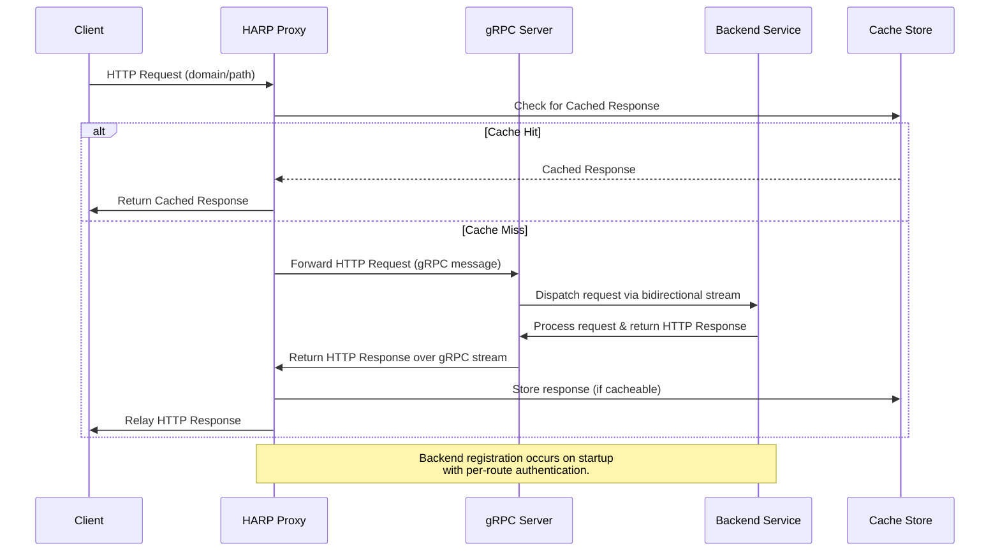

# HARP – HTTP Autoregister Reverse Proxy (gRPC Edition)

[](https://goreportcard.com/report/github.com/SimonWaldherr/HARP)
[](https://github.com/SimonWaldherr/HARP/actions)
[](./LICENSE)

HARP is a dynamic reverse proxy designed to expose backend applications (even those hidden behind NAT or firewalls) to the Internet without directly exposing them. Backends connect via gRPC, register their HTTP endpoints, and receive forwarded HTTP requests. The proxy now supports a structured configuration for per‑route authentication and includes a helper to easily wrap existing web‑applications.

---

## Table of Contents

- [Overview](#overview)
- [Architecture](#architecture)
- [How It Works](#how-it-works)
- [Sequence Diagram](#sequence-diagram)
- [Installation & Usage](#installation--usage)
- [Configuration](#configuration)
- [Examples](#examples)
- [Using the Web Handler Wrapper](#using-the-web-handler-wrapper)
- [Additional Features](#additional-features)
- [License](#license)

---

## Overview

HARP allows your internal servers (or devices like Raspberry Pis) to securely expose HTTP endpoints by connecting to a publicly hosted proxy. The backends register via gRPC using a per‑route authentication mechanism defined in the configuration. Existing web‑applications can be integrated easily using the provided handler wrapper.

---

## Architecture

- **Proxy Server:**  
  Runs both a gRPC server (for backend registration and messaging) and an HTTP/HTTPS/HTTP3 server (for client requests).  
  - Reads configuration from `config.json`.
  - Uses a structured list of allowed registrations to enforce per‑route authentication.
  - Implements caching (in‑memory or disk‑based).

- **Backend Applications:**  
  Connect to the proxy via gRPC, register their available routes, and handle forwarded HTTP requests.  
  A helper is provided so that existing net/http–based web applications can be wrapped with minimal changes.

---

## How It Works

1. **Backend Registration:**  
   A backend connects to the proxy’s gRPC server and sends a registration message with its available routes and a key.  
   The proxy checks each route against the allowed registrations defined in the configuration file. Only routes whose path matches a configured regex and whose key is correct are accepted.

2. **Request Forwarding:**  
   When the proxy receives an HTTP request, it looks up a matching registered route and forwards the request via gRPC.

3. **Response Relay & Caching:**  
   The backend processes the request and returns a response via gRPC, which the proxy relays to the client. Responses may also be cached.

---

## Sequence Diagram



---

## Installation & Usage

### Prerequisites

- [Go](https://golang.org) (v1.16 or later)
- [protoc](https://grpc.io/docs/protoc-installation/) (for regenerating proto code if needed)
- (Optional) QUIC-Go for HTTP/3 support

### Build & Run

1. **Configuration:**  
   Adjust the settings in `config.json` as required. Note the new `allowedRegistration` section which defines allowed route regexes and their corresponding keys.

2. **Build the Proxy:**  
   ```bash
   go build -o bin/harp-proxy proxy.go
   ```

3. **Run the Proxy:**  
   ```bash
   ./bin/harp-proxy -config config.json
   ```

4. **Run a Backend Example:**  
   For example, in `demos/simple-go`:
   ```bash
   go run app.go -proxy localhost:50051
   ```

---

## Configuration

The `config.json` file controls the proxy behavior. Key settings include:

- **Ports & TLS:**  
  - `grpcPort`, `httpPort`, `http3Port`
  - TLS settings for gRPC and HTTPS/HTTP3

- **Caching:**  
  - `enableCache`, `cacheType` (`memory` or `disk`), `cacheTTL`

- **Allowed Registrations:**  
  A list of objects defining allowed registration rules. For example:
  ```json
  "allowedRegistration": [
    { "route": "/foobar/.*$", "key": "secret1" },
    { "route": "/lorem/.*$",  "key": "ipsum-key" },
    { "route": "/.*$",       "key": "master-key" }
  ]
  ```
  When a backend registers, each of its routes is checked against these rules. Only routes matching a rule with the correct key are accepted.

- **Logging:**  
  Set via `logLevel` (e.g. DEBUG, INFO).

---

## Examples

The **demos/** folder includes several backend examples:

1. **Simple Go Application (demos/simple-go):**  
   Registers a `/test` route and responds with a greeting.

2. **Multi‑Service Application (demos/multi-service-go):**  
   Registers multiple routes (e.g. math operations, hello, joke) and dispatches based on URL.

3. **Wrapper Example (demos/static-wrapper-go):**  
   Uses the HARP handler wrapper to directly integrate an existing net/http–based web application.

4. **complex-harp-server:**  
   A more complex example with multiple routes.

---

## Using the Web Handler Wrapper

The new helper in `harp/handler.go` (the `BackendServer` type and its `ListenAndServeHarp()` method) lets you wrap an existing `http.Handler` so that your web application can be exposed via HARP with minimal changes. 

---

## License

HARP is released under the GPL License. See [LICENSE](./LICENSE) for details.
