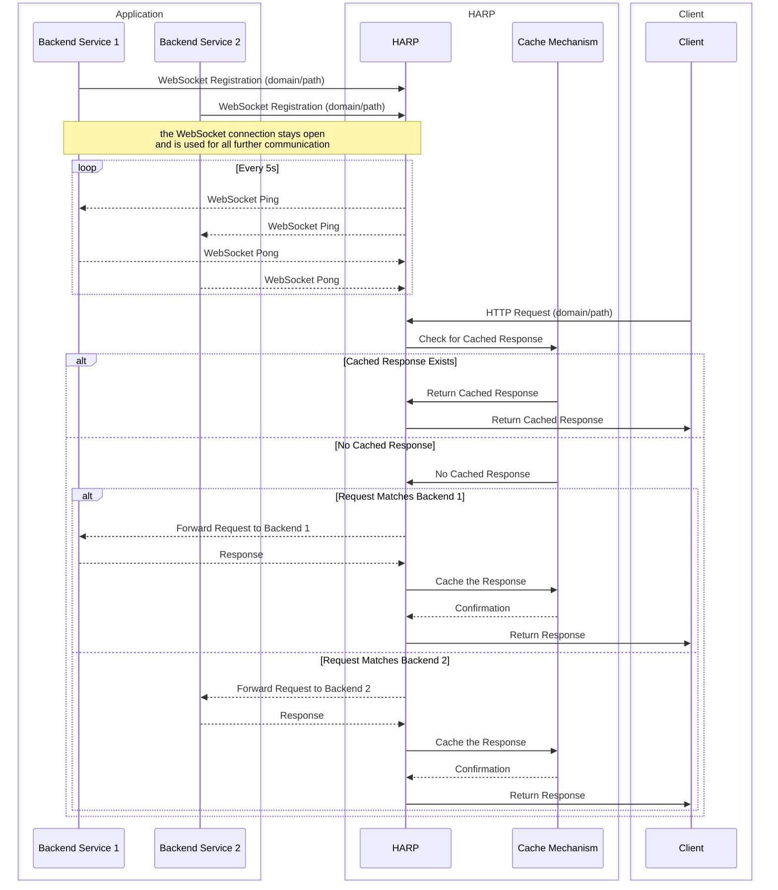

# HARP

 
  

HARP (HTTP Autoregister Reverse Proxy) is an inverting reverse proxy server which allows backend applications to register themselves and accept incoming requests from the internet without being directly exposed. The backend applications specify the domain and target URL, and the proxy server forwards incoming requests to the appropriate backend based on the domain in the request.

**HARP is currently WIP and not production ready.**

## how it works

* The proxy server listens for incoming HTTP requests.
* Backend applications register themselves by connecting via WebSocket and sending routing-information.
* When an incoming request is received, the proxy server checks if a backend is registered for the request's domain and path.
* If a matching backend is found, the proxy server forwards the request to the backend and returns the backend's response to the client.
* If no matching backend is found, the proxy server returns a 404 Not Found error.

## usage

Deploy the proxy server on a publicly accessible server.
Start your backend application (it even works on a non-publicly accessible server).

## use cases

the final project will help you for the following demands:

* Caching
* Dynamic Scaling and Load Balancing
* Service Migration
* Internal Tooling and Debugging
* Local Development
* Microservices Development
* Temporary Services

## sequence diagram

