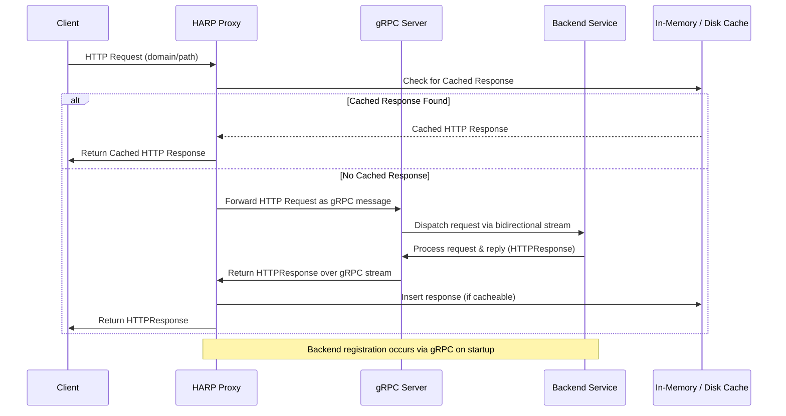

# HARP – HTTP Autoregister Reverse Proxy (gRPC Edition)

[](https://goreportcard.com/report/github.com/SimonWaldherr/HARP)
[](https://github.com/SimonWaldherr/HARP/actions)
[](./LICENSE)

_HARP (HTTP Autoregister Reverse Proxy)_ is a dynamic reverse proxy designed for modern microservice architectures. In this gRPC edition, backend services register themselves over a bidirectional gRPC stream, allowing them to expose HTTP endpoints without being directly reachable from the public network. Instead, HARP acts as a gateway that forwards client HTTP requests to registered backends and relays their responses back to the client.

---

## Table of Contents

- [Overview](#overview)
- [Architecture](#architecture)
- [How It Works](#how-it-works)
- [Sequence Diagram](#sequence-diagram)
- [Installation & Usage](#installation--usage)
- [Configuration](#configuration)
- [Additional Features & Improvements](#additional-features--improvements)
- [License](#license)

---

## Overview

HARP leverages gRPC’s bidirectional streaming to allow backend services to dynamically register routes and receive HTTP requests forwarded by the proxy. The proxy itself runs both a gRPC server (for backend registration and communication) and an HTTP server (for handling client requests). It also supports multiple protocols: plain HTTP, HTTPS, and HTTP/3 (QUIC). In addition, it features configurable caching options (in‑memory or disk‑based) to reduce backend load.

---

## Architecture

HARP is composed of two major parts:

1. **Backend Registration & Processing (gRPC Client)**
   - **Backend Application:** Implements local HTTP handlers to process requests.
   - **HARP Client Library:** Connects to the HARP proxy via gRPC, sends a registration message (with route information), and waits on a bidirectional stream for forwarded HTTP requests.

2. **HARP Proxy (gRPC Server & HTTP Server)**
   - **gRPC Server:** Accepts bidirectional streaming connections from backend applications, maintains an internal registry of routes, and handles responses.
   - **HTTP Server:** Accepts client HTTP requests, finds a matching backend (by inspecting route patterns), forwards requests via the gRPC stream, and returns the backend’s response to the client.

---

## How It Works

1. **Backend Registration:**  
   A backend service connects to the HARP proxy’s gRPC server and sends a registration message with its available routes (domain and path patterns).

2. **Request Forwarding:**  
   When a client sends an HTTP request, the proxy checks its cache (if enabled) and then matches the request URL to a registered backend route. The proxy forwards the request as a gRPC message.

3. **Response Handling:**  
   The backend processes the request and sends an HTTP response via the same gRPC stream. The proxy relays this response back to the client and caches it if appropriate.

---

## Sequence Diagram



---

## Installation & Usage

### Prerequisites

- [Go](https://golang.org) (v1.16 or later)
- [protoc](https://grpc.io/docs/protoc-installation/) (Protocol Buffers compiler)
- [gRPC-Go](https://github.com/grpc/grpc-go) and related plugins

### Building the Project

1. **Generate gRPC Code:**  
   In the project root, run:
   ```bash
   make proto
   ```
2. **Build the Proxy and Backend:**
   ```bash
   make build
   ```

### Running the System

1. **Start the Proxy:**  
   ```bash
   make run-proxy
   ```
   This starts the gRPC server on the default port (`:50051`) and the HTTP server on (`:8080`). Use command‑line flags to enable HTTPS or HTTP/3 if desired.

2. **Start a Demo Backend:**  
   In a separate terminal, run:
   ```bash
   make run-backend
   ```
   The backend connects to the proxy, registers its routes, and listens for requests.

3. **Test the Setup:**  
   For example:
   ```bash
   curl http://localhost:8080/test
   ```

---

## Configuration

HARP is highly configurable via command‑line flags. Here are some key options:

### Proxy Configuration

- **gRPC Server Settings:**
  - `-grpc-port`: gRPC server address (default: `:50051`)
  - `-grpc-tls`: Enable TLS for gRPC
  - `-grpc-cert` and `-grpc-key`: Paths to TLS certificate and key for gRPC

- **HTTP Server Settings:**
  - `-http-port`: HTTP server address (default: `:8080`)
  - `-https`: Enable HTTPS
  - `-https-cert` and `-https-key`: TLS certificate and key for HTTPS

- **HTTP/3 / QUIC:**
  - `-http3`: Enable HTTP/3 (requires HTTPS)
  - `-http3-port`: HTTP/3 server address (default: `:8443`)

- **Caching:**
  - `-enable-cache`: Enable response caching (default: true)
  - `-cache-type`: Cache type: `memory` or `disk` (default: `memory`)
  - `-disk-cache-dir`: Directory for disk cache (if using disk cache)
  - `-cache-ttl`: Cache expiration time (default: 30m)

### Logging & Miscellaneous

- `-log-level`: Set log verbosity (`DEBUG`, `INFO`, etc.)

---

## License

HARP is released under the [GPL License](./LICENSE).

---

Contributions, issues, and feature requests are welcome. Enjoy building dynamic, secure, and scalable microservice systems with HARP!


## Final Notes

- **Generate gRPC Code:**  
  Run `make proto` to generate the Go code from `harp.proto`.

- **Build the Project:**  
  Use `make build` to compile both the proxy and demo backend.

- **Run the Services:**  
  Start the proxy with `make run-proxy` and the demo backend with `make run-backend`.

- **Configure Protocols & Caching:**  
  Use command‑line flags (or extend the flag parsing) to enable HTTPS, HTTP/3, or change cache type/settings.

This complete set of files provides a fully functional, configurable, and extensible HARP proxy project using gRPC for dynamic backend registration and HTTP request forwarding. Enjoy!