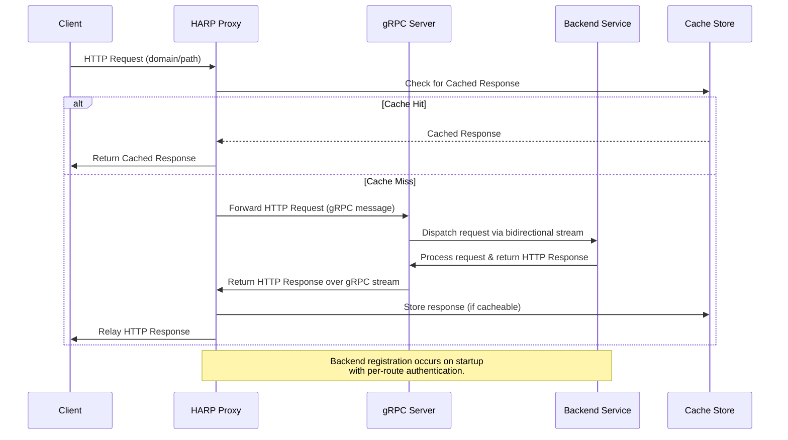

# HARP – HTTP Autoregister Reverse Proxy (gRPC Edition)

[](https://goreportcard.com/report/github.com/SimonWaldherr/HARP)
[](https://github.com/SimonWaldherr/HARP/actions/workflows/go.yml)
[](./LICENSE)

HARP is a dynamic reverse proxy designed to expose backend applications (even those hidden behind NAT or firewalls) to the Internet without directly exposing them. Backends connect via gRPC, register their HTTP endpoints, and receive forwarded HTTP requests. The proxy supports per‑route authentication, caching, rate limiting, CORS, graceful shutdown, and includes helpers to easily wrap existing web‑applications.

---

## Why HARP?

Exposing a service on the Internet traditionally requires a public IP address, open firewall ports, DNS configuration, and TLS certificates — all before a single request is served. For devices behind NAT (home servers, Raspberry Pis, IoT gateways) or ephemeral developer machines, this is impractical or impossible.

HARP flips the model: **the backend initiates the connection outward** to a publicly hosted proxy. No inbound ports, no port forwarding, no VPN tunnels. The proxy accepts regular HTTP traffic from clients and shuttles it to the correct backend over a persistent gRPC stream. This means:

- **A Raspberry Pi behind a home router** can serve a public website without touching the router config.
- **A corporate laptop** can expose a local dev server to external testers with zero infrastructure changes.
- **IoT devices and home automation hubs** (Home Assistant, sensor networks) become reachable from anywhere, authenticated and rate‑limited at the proxy layer.
- **Microservices in restricted networks** can register and deregister routes dynamically, turning the proxy into a self‑updating service mesh entry point.

Unlike traditional reverse proxies (nginx, HAProxy, Traefik) that require the backend to be network‑reachable from the proxy, HARP works in the opposite direction. Unlike tunneling tools (ngrok, Cloudflare Tunnel) it is fully self‑hosted, open source, and gives you complete control over routing, authentication, caching, and observability — all in a single, dependency‑free Go binary.

---

## Table of Contents

- [Overview](#overview)
- [Features](#features)
- [Architecture](#architecture)
- [How It Works](#how-it-works)
- [Sequence Diagram](#sequence-diagram)
- [Installation & Usage](#installation--usage)
- [Configuration](#configuration)
- [Makefile](#makefile)
- [Examples](#examples)
- [Using the Web Handler Wrapper](#using-the-web-handler-wrapper)
- [HARP Gateway Agent](#harp-gateway-agent)
- [License](#license)

---

## Overview

HARP allows your internal servers (or devices like Raspberry Pis) to securely expose HTTP endpoints by connecting to a publicly hosted proxy. The backends register via gRPC using a per‑route authentication mechanism defined in the configuration. Existing web‑applications can be integrated easily using the provided handler wrapper.

---

## Features

- **Per-route authentication** with regex matching and secret keys
- **In-memory and disk-based caching** with configurable TTL and LRU eviction
- **Rate limiting** per client IP with automatic memory cleanup
- **Request body size limits** to prevent abuse and OOM
- **CORS support** with configurable allowed origins
- **X-Request-ID tracing** — every proxied response includes a unique request ID header
- **Per-route metrics** — track request counts per route via `/metrics`
- **Graceful shutdown** — drains connections on SIGINT/SIGTERM
- **Health check endpoint** at `/health` with uptime and backend count
- **Prometheus-style metrics** and pprof profiling endpoints
- **HTTP, HTTPS, and HTTP/3** support
- **Config validation** on startup (TLS, regex, duration parsing)
- **Auto-reconnecting backends** with configurable reconnect interval
- **Two integration modes:** `BackendServer` (wrap `http.Handler`) and `RemoteHelper` (function-based)

---

## Architecture

- **Proxy Server:**  
  Runs both a gRPC server (for backend registration and messaging) and an HTTP/HTTPS/HTTP3 server (for client requests).  
  - Reads configuration from `config.json`.
  - Uses a structured list of allowed registrations to enforce per‑route authentication.
  - Implements caching (in‑memory or disk‑based).

- **Backend Applications:**  
  Connect to the proxy via gRPC, register their available routes, and handle forwarded HTTP requests.  
  A helper is provided so that existing net/http–based web applications can be wrapped with minimal changes.

---

## How It Works

1. **Backend Registration:**  
   A backend connects to the proxy’s gRPC server and sends a registration message with its available routes and a key.  
   The proxy checks each route against the allowed registrations defined in the configuration file. Only routes whose path matches a configured regex and whose key is correct are accepted.

2. **Request Forwarding:**  
   When the proxy receives an HTTP request, it looks up a matching registered route and forwards the request via gRPC.

3. **Response Relay & Caching:**  
   The backend processes the request and returns a response via gRPC, which the proxy relays to the client. Responses may also be cached.

---

## Sequence Diagram


```mermaid
sequenceDiagram
    participant Client as Client
    participant Proxy as HARP Proxy
    participant GRPC as gRPC Server
    participant Backend as Backend Service
    participant Cache as Cache Store

    Client->>Proxy: HTTP Request (domain/path)
    Proxy->>Cache: Check for Cached Response
    alt Cache Hit
        Cache-->>Proxy: Cached Response
        Proxy->>Client: Return Cached Response
    else Cache Miss
        Proxy->>GRPC: Forward HTTP Request (gRPC message)
        GRPC->>Backend: Dispatch request via bidirectional stream
        Backend->>GRPC: Process request & return HTTP Response
        GRPC->>Proxy: Return HTTP Response over gRPC stream
        Proxy->>Cache: Store response (if cacheable)
        Proxy->>Client: Relay HTTP Response
    end

    note over Backend,Proxy: Backend registration occurs on startup<br/>with per‑route authentication.
```

---

## Installation & Usage

### Prerequisites

- [Go](https://golang.org) (v1.16 or later)
- [protoc](https://grpc.io/docs/protoc-installation/) (for regenerating proto code if needed)
- (Optional) QUIC-Go for HTTP/3 support

### Build & Run

1. **Configuration:**  
   Adjust the settings in `config.json` as required. See the [Configuration](#configuration) section below.

2. **Build everything (proxy + demos):**  
   ```bash
   make build
   ```

3. **Run the Proxy:**  
   ```bash
   make run
   # or directly:
   ./bin/harp-proxy -config config.json
   ```

4. **Run a Backend Example:**  
   ```bash
   make run-demo-simple
   ```

5. **Full demo workflow** (starts proxy, demo backend, sends a test request, then cleans up):
   ```bash
   make demo
   ```

---

## Configuration

The `config.json` file controls the proxy behavior:

| Setting | Type | Default | Description |
|---------|------|---------|-------------|
| `grpcPort` | string | `:50054` | gRPC server listen address |
| `httpPort` | string | `:8080` | HTTP server listen address |
| `http3Port` | string | `:8445` | HTTP/3 (QUIC) listen address |
| `enableGRPCTLS` | bool | `false` | Enable TLS for gRPC |
| `enableHTTPS` | bool | `false` | Enable HTTPS server |
| `enableHTTP3` | bool | `false` | Enable HTTP/3 (requires HTTPS) |
| `enableCache` | bool | `true` | Enable response caching |
| `cacheType` | string | `memory` | `memory` or `disk` |
| `cacheTTL` | string | `30m` | Cache entry TTL (Go duration) |
| `enableRateLimit` | bool | `true` | Enable per-IP rate limiting |
| `rateLimitPerSecond` | int | `100` | Max requests per second per IP |
| `maxRequestBodySize` | int | `10485760` | Max request body in bytes (10 MB) |
| `enableCORS` | bool | `false` | Enable CORS headers |
| `corsAllowedOrigins` | string | `*` | Allowed CORS origins |
| `enableAdminUI` | bool | `false` | Enable the built-in web admin dashboard |
| `adminPath` | string | `/admin` | Admin dashboard path when enabled |
| `adminUsername` | string | `admin` | Admin dashboard Basic Auth username |
| `adminPassword` | string | empty | Admin dashboard Basic Auth password; empty disables admin auth |
| `enableHealthCheck` | bool | `true` | Enable `/health` endpoint |
| `enableMetrics` | bool | `true` | Enable `/metrics` + pprof |
| `metricsPort` | string | `:9091` | Metrics server listen address |
| `requestTimeout` | string | `30s` | Backend response timeout |
| `readTimeout` | string | `30s` | HTTP read timeout |
| `writeTimeout` | string | `30s` | HTTP write timeout |
| `idleTimeout` | string | `120s` | HTTP idle timeout |
| `maxHeaderSize` | int | `8192` | Max HTTP header bytes |
| `gracefulShutdownDelay` | string | `10s` | Drain time on SIGINT/SIGTERM |
| `logLevel` | string | `DEBUG` | Log level (`DEBUG`, `INFO`, …) |

**Allowed Registrations:**

```json
"allowedRegistration": [
  { "route": "/foobar/.*$", "key": "secret1", "username": "demo", "password": "route-secret" },
  { "route": "/lorem/.*$",  "key": "ipsum-key" },
  { "route": "/.*$",       "key": "master-key" }
]
```

When a backend registers, each route is checked against these rules. Only routes matching a rule regex with the correct key are accepted. Invalid regexes are caught at startup.
Set `username` and `password` on a rule to require HTTP Basic Auth before client requests are forwarded to matching registered routes. Leave `password` empty to keep that route open. If multiple rules match a registered route, the most specific rule wins, based on the longest route regex. This lets a catch-all registration coexist with route-specific passwords. The proxy strips the Basic Auth header after successful route authentication so route credentials are not sent to the backend.

---

## Makefile

A `Makefile` is provided for common workflows:

```bash
make              # fmt + vet + test + build
make build        # Build proxy, gateway, and all demo binaries
make build-gateway # Build just the harp-gateway agent
make test         # Run all tests
make test-cover   # Tests with coverage report
make test-race    # Tests with Go race detector
make run          # Build and start the proxy
make run-gateway  # Build and start the gateway agent
make demo         # Full end-to-end demo (proxy + backend + curl)
make demo-admin   # End-to-end demo with the web admin UI enabled
make clean        # Remove build artifacts
make help         # Show all available targets
```

Override defaults with environment variables:

```bash
CONFIG=production.json make run
PROXY_ADDR=remote.host:50054 make run-demo-simple
```

---

## Examples

The **demos/** folder includes several backend examples:

1. **Simple Go Application (demos/simple-go):**  
   Registers a `/test` route and responds with a greeting.

2. **Multi‑Service Application (demos/multi-service-go):**  
   Registers multiple routes (e.g. math operations, hello, joke) and dispatches based on URL.

3. **Wrapper Example (demos/static-wrapper-go):**  
   Uses the HARP handler wrapper to directly integrate an existing net/http–based web application.

4. **complex-harp-server:**  
   A more complex example with multiple routes.

5. **Remote Helper (demos/remote-helper-go):**  
   A lightweight helper running on a home network that exposes local resources
   (Home Assistant state, local commands) to a public HARP proxy without
   requiring any inbound firewall rules.

6. **LLM Gateway Demo (demos/llm-gateway):**  
   Exposes local Ollama / LM Studio / llmster endpoints through your public
   HARP proxy (on any public host) using `harp-gateway` JSON config only.

---

## Using the Web Handler Wrapper

The `BackendServer` type in `harpserver/handler.go` and its `ListenAndServeHarp()` method lets you wrap an existing `http.Handler` so that your web application can be exposed via HARP with minimal changes.

**Multi-route support:** Populate the `Routes []RouteConfig` field to register different routes each served by their own `http.Handler`:

```go
server := &harpserver.BackendServer{
    Name:     "MyService",
    ProxyURL: "proxy.example.com:50054",
    Key:      "master-key",
    Domain:   ".*",
    Routes: []harpserver.RouteConfig{
        {Name: "API",    Path: "/api/",  Handler: apiRouter},
        {Name: "Static", Path: "/static/", Handler: staticHandler},
    },
    ReconnectInterval: 5 * time.Second, // auto-reconnect on disconnect
}
server.ListenAndServeHarp()
```

---

## Remote Helpers (OpenClaw / libreClaw use-case)

`RemoteHelper` (in `harpserver/helper.go`) enables a lightweight agent running
on a **private network** (e.g. a MacBook at home) to register function-based
route handlers with a **public HARP proxy** without needing open inbound ports.

This is the recommended approach for:
- Home automation bridges (Home Assistant, Apple HomeKit, …)
- IoT device proxies behind NAT
- Developer laptops exposing local services for testing

```go
helper := &harpserver.RemoteHelper{
    Name:              "HomeNetworkHelper",
    ProxyURL:          "proxy.example.com:50054",
    Key:               "master-key",
    Domain:            ".*",
    ReconnectInterval: 5 * time.Second,
}

// Register a route that queries the local Home Assistant instance.
helper.Register("/helper/homeassistant", "HomeAssistant",
    func(r *http.Request) (int, map[string]string, string) {
        entity := r.URL.Query().Get("entity")
        // Call http://localhost:8123/api/states/<entity> here …
        return 200, map[string]string{"Content-Type": "application/json"}, `{"state":"on"}`
    },
)

log.Fatal(helper.ListenAndServe()) // blocks; auto-reconnects on disconnect
```

See `demos/remote-helper-go/main.go` for a full working example.

---

## HARP Gateway Agent

The **harp-gateway** (`cmd/harp-gateway/`) is a standalone binary that exposes local HTTP services through a remote HARP proxy — configured entirely via a JSON file, no Go code required. Install it on a Raspberry Pi, NAS, or any machine on your home network and describe which local services to publish:

```bash
make build-gateway
./bin/harp-gateway -config gateway.json
```

### Gateway Config (`gateway.json`)

```json
{
  "name": "raspi-gateway",
  "proxyURL": "proxy.example.com:50054",
  "key": "master-key",
  "domain": ".*",
  "reconnectInterval": "5s",
  "upstreamMaxIdleConns": 200,
  "upstreamMaxIdleConnsPerHost": 100,
  "upstreamMaxConnsPerHost": 0,
  "services": [
    {
      "name": "Home Assistant",
      "route": "/homeassistant/",
      "upstream": "http://localhost:8123",
      "stripPrefix": true,
      "streaming": true,
      "addHeaders": {
        "Authorization": "Bearer YOUR_HA_TOKEN"
      },
      "timeoutSeconds": 15
    },
    {
      "name": "Pi-hole Admin",
      "route": "/pihole/",
      "upstream": "http://localhost:80/admin",
      "stripPrefix": true
    },
    {
      "name": "Grafana",
      "route": "/grafana/",
      "upstream": "http://localhost:3000",
      "stripPrefix": true
    }
  ]
}
```

### Service Config Fields

| Field | Type | Default | Description |
|-------|------|---------|-------------|
| `name` | string | *required* | Human-readable service label |
| `route` | string | *required* | Public path prefix registered with the proxy |
| `upstream` | string | *required* | Local HTTP base URL to forward requests to |
| `stripPrefix` | bool | `false` | Remove the route prefix before forwarding (e.g. `/pihole/admin/index` → `/admin/index`) |
| `streaming` | bool | `false` | Enable chunked streaming relay for long-lived responses (SSE/token streams) |
| `addHeaders` | object | `{}` | Extra headers injected into every upstream request (auth tokens, API keys, …) |
| `timeoutSeconds` | int | `30` | Per-request timeout for the upstream call |

### How It Works

1. The gateway reads `gateway.json` and registers one HARP route per service.
2. When a client hits `https://proxy.example.com/homeassistant/api/states`, the HARP proxy forwards the request to the gateway over gRPC.
3. The gateway strips the `/homeassistant` prefix (if configured), adds any extra headers, and forwards to `http://localhost:8123/api/states`.
4. The upstream response is relayed back through gRPC to the proxy and then to the client.

Auto-reconnect is built in — if the connection to the proxy drops, the gateway retries every `reconnectInterval`.

See [cmd/harp-gateway/gateway-example.json](cmd/harp-gateway/gateway-example.json) for the full example config.
For a ready-to-use home-LLM setup, see [demos/llm-gateway](demos/llm-gateway/).

---

## Observability

When `enableMetrics` is `true`, a separate HTTP server starts on `metricsPort` exposing:

| Endpoint | Description |
|----------|-------------|
| `/metrics` | JSON metrics: request totals, cache hits/misses, backend errors, per-route counts, rate-limited requests, memory stats |
| `/health` | Health check with uptime and connected backend count |
| `/debug/pprof/` | Go pprof profiling endpoints |
| `/debug/vars` | expvar variables |

Every proxied response includes an `X-Request-ID` header for end-to-end tracing.

## Web Admin UI

Set `enableAdminUI` to `true` to serve a lightweight dashboard at `adminPath`
(default `/admin`). It shows current backend routes, request counters, cache
state, and Go runtime scheduler metrics. Set `adminPassword` to require Basic
Auth for both the HTML dashboard and `/admin/api/status`. Keep the UI disabled
on public deployments unless the surrounding network or reverse proxy also
restricts access.

Run the admin demo:

```bash
make demo-admin
```

The demo uses `admin/admin-demo` for the admin UI and `demo/route-demo` for
the protected proxied route.

---

## License

HARP is released under the GPL License. See [LICENSE](./LICENSE) for details.
